# Анализ отказоустойчивости систем на основе микросервисной архитектуры

## Идея проекта
Современные системы нередко строятся на основе микросервисной архитектуры, состоящей из различных
**компонентов**, например микросервисов, БД, внешних API, брокеров сообщений и других. Данные
компоненты так или иначе связаны друг с другом. Идея заключается в поиске компонентов, которые
станут недоступны вследствие отказа какого-либо выбранного компонента системы. Таким образом 
можно находить наиболее критичные места в построенной инфраструктуре и принимать решения для усиления
ее отказоустойчивости. Система **не предназначена** для мониторинга инфраструктуры в реальном времени.
Только для анализа при проектировании или изменении.

## Описание предметной области
Предметная область проекта охватывает управление надежностью распределенных программных систем 
и анализ топологии микросервисной архитектуры. Система предназначена для моделирования IT-инфраструктуры 
в виде ориентированного графа зависимостей, что позволяет автоматизировать поиск единых точек отказа 
и прогнозировать распространение каскадных сбоев. Основными сущностями предметной области являются:
- **компонент**, может представлять одну из следующих сущностей:
    - микросервис;
    - база данных;
    - брокер сообщений;
    - внешний API;
- **связь** между компонентами, может иметь различный уровень критичности, также в будущем можно добавить,
например, задержку по связи для моделирования более сложных ситуаций.

## Анализ аналогичных решений

| Критерий сравнения | **Разрабатываемая система** | **ITRS Geneos** | **Prometheus + Grafana** |
| :--- | :--- | :--- | :--- |
| **Основное назначение** | Проектирование архитектуры, поиск узких мест, симуляция. | Контроль состояния серверов и приложений в реальном времени. | Сбор и визуализация метрик, анализ трендов. |
| **Модель данных** | Графовая | Иерархическая | Временные ряды |
| **Метод выявления проблем** | **Предиктивный.**  Поиск потенциальных проблем на основе структуры графа. | **Реактивный.** Сравнение текущих значений с пороговыми и правилами. | **Реактивный.** Мониторинг, отклонений, оповещения. |
| **Анализ влияния** | **Автоматизированный.** Автоматический расчет каскадного эффекта при отказе узла на основе связей. | **Ручной / Правила.** Требует сложной настройки корреляции событий. | **Отсутствует.** Показывает состояние метрик, но не моделирует зависимости сбоев. |

## Актуальность проекта
Как было сказано при описании идеи проекта, множество систем строится на основе микросервисной архитектуры.
В сложных системах могут быть десятки и сотни компонентов с тысячами связей, что значительно усложняет процесс
поиска всех компонентов, зависящих от данного.
Инструмент для анализа цепочек отказов поможет архитекторам выявлять узкие места и уязвимости системы еще на 
этапе проектирования, и, таким образом, минимизировать риски простоев бизнеса.

## Описание ролей
Для взаимодействия с системой были выделены следующие роли пользователей:
- архитектор - имеет полные права на редактирование графа инфраструктуры, может создавать различные системы и 
назначать на них конкретные команды; может запускать все сценарии анализа, смотреть логи, отчеты и т.д.;
- SRE/DevOps - имеет доступ к просмотру инфраструктуры и результатам анализа; может запускать все сценарии анализа;
- разработчик - имеет доступ к просмотру зависимостей только тех сервисов, за которые отвечает его команда; 
использует систему для понимания того, какие смежные системы могут пострадать при обновлении или 
остановке его сервиса;
- администратор - манипулирует пользователями, командами, может изменять роли пользователей, менять их членство
в командах, выдавать приглашения пользователям, удалять пользователей из системы и т.д.;
- незарегистрированный пользователь - может авторизоваться.

## Use-Case
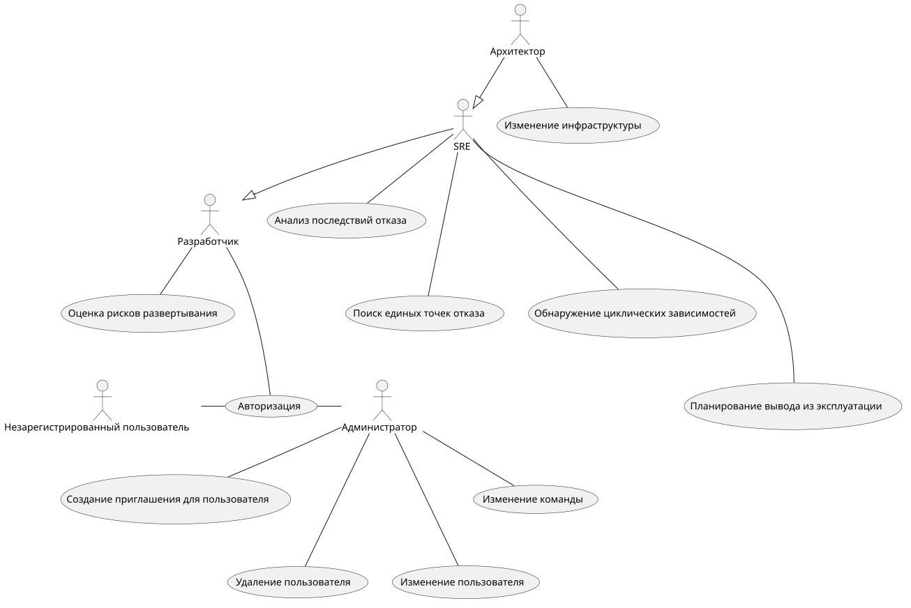

## ER
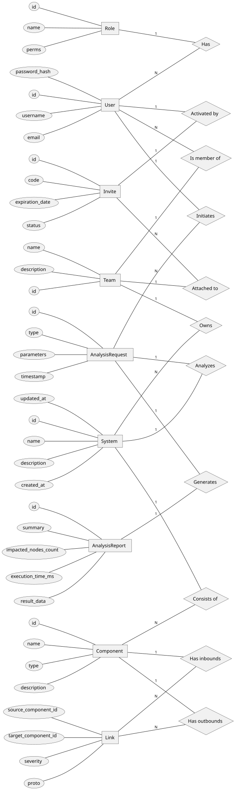

## Пользовательские сценарии

### Сценарий 1: Проведение анализа каскадного сбоя
- **Актор:** SRE / DevOps / Architect.
- **Предусловие:** Пользователь авторизован, выбрана целевая IT-система, в графе присутствует хотя бы один компонент.
- **Основной сценарий:**
  1. Пользователь выбирает узел компонента на интерактивном холсте двойным кликом.
  2. Система открывает боковую панель свойств компонента.
  3. Пользователь нажимает кнопку «Сымитировать падение».
  4. Клиент отправляет GET-запрос `/api/v1/analysis/simulate/{id}`.
  5. Сервер вычисляет транзитивно зависимые узлы через Neo4j и возвращает список UUID затронутых компонентов.
  6. Система переходит в режим анализа: подсвечивает упавший узел и пораженные компоненты пульсирующим красным контуром, обесцвечивает изолированные узлы и выводит Snackbar с количеством затронутых сервисов.
- **Альтернативный сценарий (Компонент не имеет зависимостей):**
  - На шаге 5 сервер возвращает пустой список.
  - На шаге 6 система выводит сообщение: «Сбой не привел к каскадному отказу других компонентов», граф не меняет цветовую схему.
- **Постусловие:** На холсте отображена визуализация распространения сбоя до момента нажатия кнопки «Выйти из режима анализа».

### Сценарий 2: Добавление нового компонента в топологию
- **Актор:** Architect.
- **Предусловие:** Архитектор находится на странице дашборда с выбранной системой команды.
- **Основной сценарий:**
  1. Архитектор нажимает кнопку «Добавить компонент».
  2. Система отображает диалоговое окно.
  3. Архитектор вводит имя компонента, описание и выбирает тип (Microservice, Database, MessageBroker, ExternalAPI).
  4. Нажимает кнопку "Создать".
  5. Клиент отправляет POST-запрос на `/api/v1/components`.
  6. API валидирует данные, генерирует UUID, записывает узел в Neo4j и возвращает код 200 с UUID.
  7. Модальное окно отображает статус успеха и сгенерированный GUID.
  8. После закрытия диалога клиент вызывает перерисовку графа, новый узел появляется на холсте.
- **Альтернативный сценарий (Ошибка валидации входных данных):**
  - На шаге 3 архитектор оставляет поле «Имя» пустым или состоящим из пробелов.
  - Кнопка «Создать» остается заблокированной на клиенте. Если запрос отправлен в обход UI, сервер возвращает HTTP 400, клиент перехватывает ошибку через `ErrorHandler` и отображает текст ошибки во всплывающем уведомлении.
- **Постусловие:** Новый компонент доступен для соединения связями и проведения расчетов.

### Сценарий 3: Регистрация пользователя по инвайт-коду
- **Актор:** Новый сотрудник (незарегистрированный пользователь).
- **Предусловие:** Администратор предварительно сгенерировал инвайт с привязкой к конкретной команде и email.
- **Основной сценарий:**
  1. Пользователь переходит на страницу `/register`.
  2. Вводит свой email, желаемый логин, пароль (не менее 8 символов) и переданный администратором хеш-код инвайта.
  3. Нажимает "Присоединиться".
  4. Клиент отправляет данные на `/api/v1/users/register`.
  5. Сервер проверяет:
     - Уникальность username и email в PostgreSQL/MongoDB;
     - Существование инвайта по коду, статус `Pending` и совпадение email;
     - Срок действия инвайта (`ExpirationDate > UtcNow`).
  6. Сервер сохраняет запись пользователя с ролью и TeamId из инвайта, переводит инвайт в статус `Activated`.
  7. Клиент выполняет автоматический вход (POST `/api/v1/users/login`), получает JWT, записывает auth-куку и выполняет редирект на дашборд.
- **Альтернативный сценарий (Инвайт просрочен или отозван):**
  - На шаге 5 сервер обнаруживает статус `Expired` или `Revoked`.
  - Сервер возвращает HTTP 400 с пояснением причины.
  - Клиент отображает уведомление об ошибке, создание пользователя прерывается.
- **Постусловие:** Пользователь зарегистрирован в системе, привязан к команде и аутентифицирован.

## BPMN

### 1. BPMN диаграмма авторизации
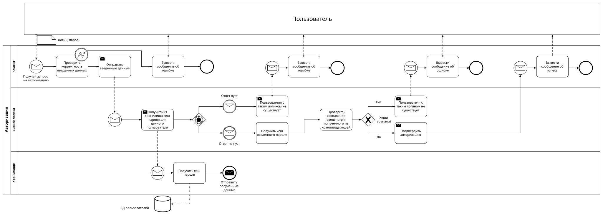

### 2. BPMN диаграмма добавления компонента
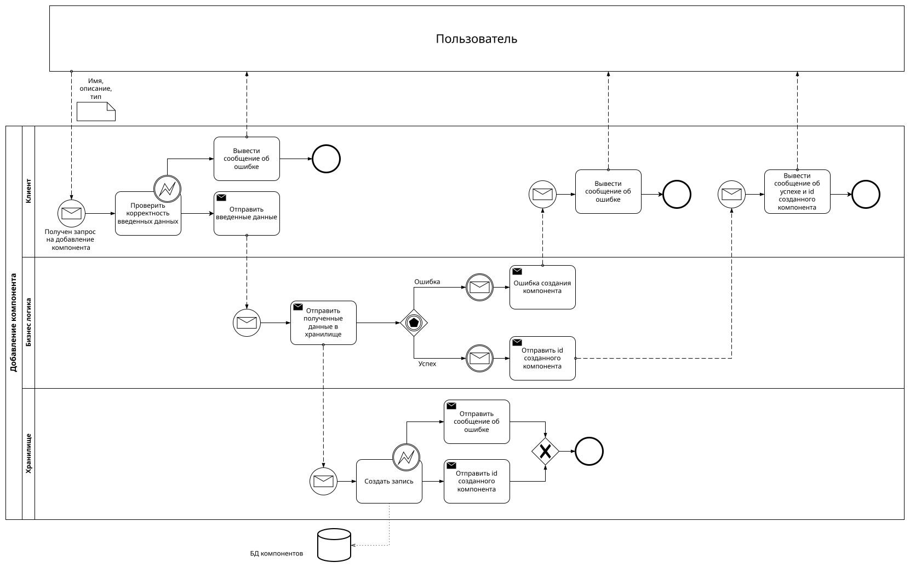

### 3. BPMN диаграмма проведения анализа влияния отказа компонента
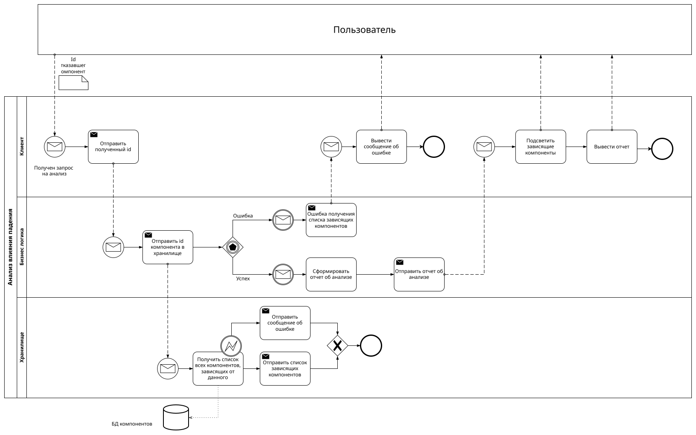

## Описание стека
Бэкенд: C# / .NET 10, ASP.NET Core Web API. Архитектура: Clean Architecture (Domain, Application, Infrastructure, API). Аутентификация через JWT Bearer.

Фронтенд: Blazor Interactive Server (C#), компонентная библиотека MudBlazor. Визуализация графов: Z.Blazor.Diagrams с кастомной версткой узлов (ComponentWidget) и расчетом раскладки (силовая модель Fruchterman-Reingold).

Хранение данных:
- Графовая СУБД: Neo4j - хранение узлов топологии и направленных связей, графовые алгоритмы обхода.
- Основная СУБД: PostgreSQL - хранение учетных записей, команд, инвайтов, бинарных данных аватаров (WebP) и метаинформации IT-систем.

Доставка и развертывание: Docker, Docker Compose (контейнеризация сервисов API, Frontend, Neo4j, PostgreSQL, Seq для сбора логов через Serilog).

## C4

### L1
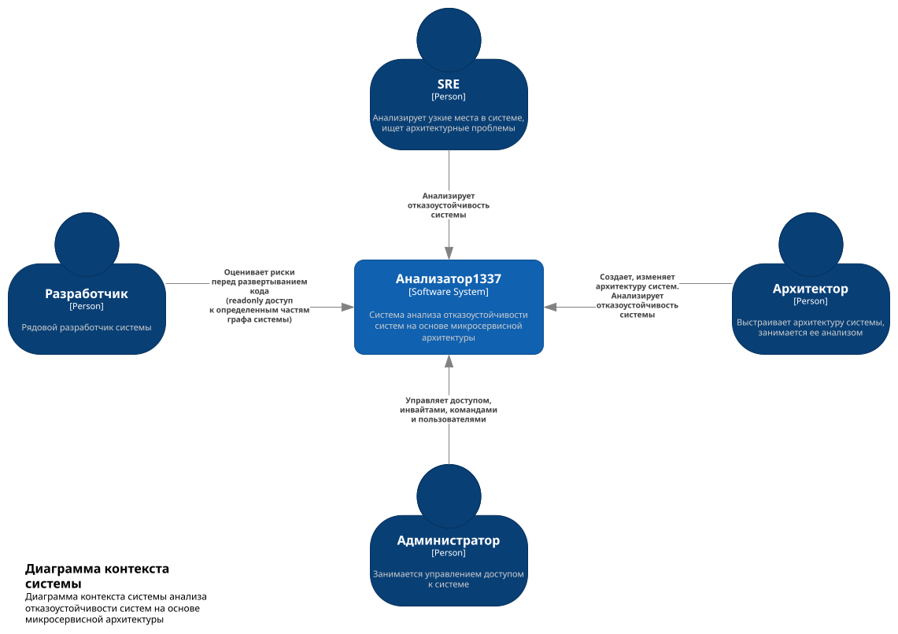

### L2
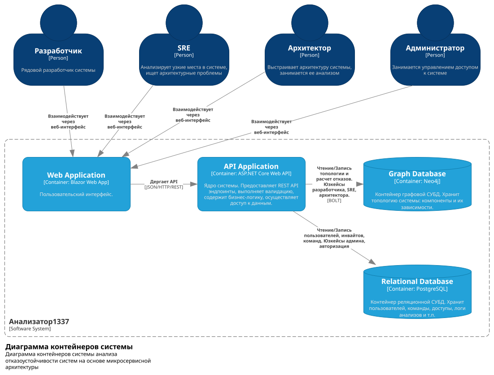

### L3

### L4

## Dataflow

### 1. Авторизация
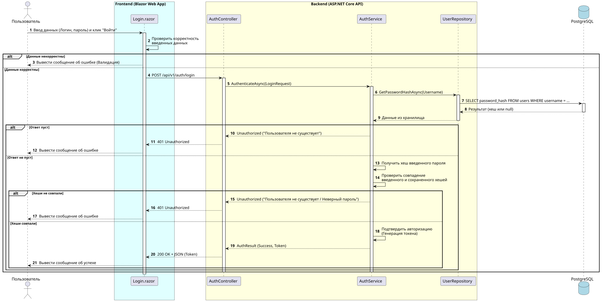

### 2. Добавление компонента
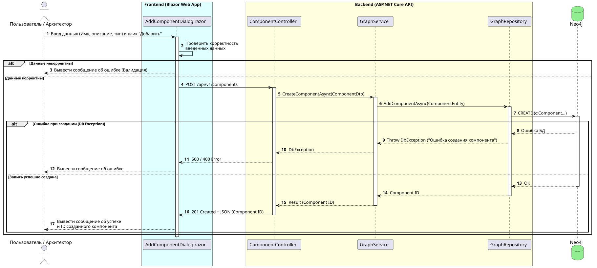

### 3. Проведение анализа влияния отказа компонента
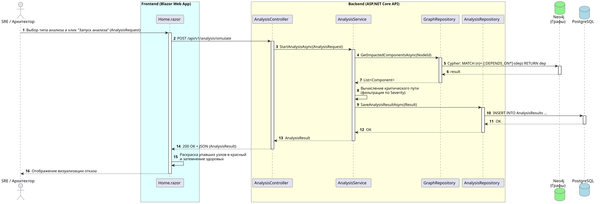

## DBML
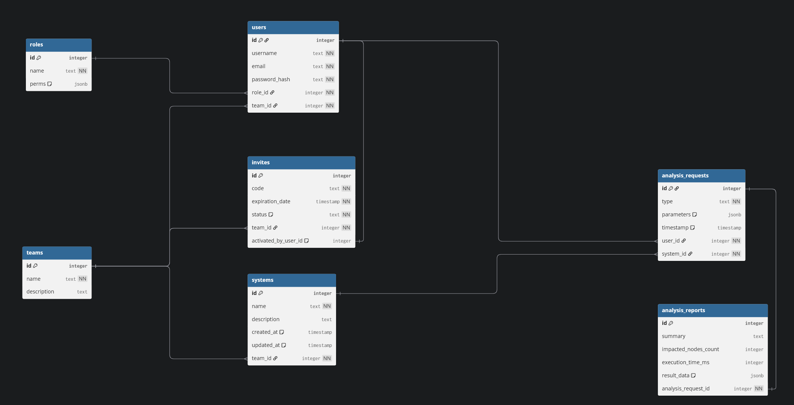

## Функциональные требования
1. **Управление инфраструктурным графом:**
   - Добавление, редактирование и удаление компонентов инфраструктуры (микросервис, БД, брокер сообщений, внешний API).
   - Создание и удаление направленных связей между компонентами с указанием типа протокола (REST, gRPC, SOAP, AMQP, TCP) и уровня критичности (Low, Mid, High).
   - Экспорт топологии системы в JSON и импорт топологии из JSON-файла.
2. **Анализ отказоустойчивости:**
   - Симуляция каскадного отказа: определение всех зависимых узлов при падении выбранного компонента.
   - Поиск циклических зависимостей в топологии системы.
   - Детекция единых точек отказа на основе заданного порога зависимостей.
   - Оценка последствий вывода компонента из эксплуатации.
   - Оценка риска развертывания на основе суммарной критичности связей в цепочке.
3. **Разграничение доступа и администрирование:**
   - Аутентификация пользователей по связке логин/пароль с выдачей JWT.
   - Ролевая модель доступа: Admin, Architect, SRE, Developer.
   - Генерация одноразовых инвайтов с ограниченным сроком действия для привязки пользователей к командам.
   - Управление профилем.

## Ключевые нефункциональные требования
1. **Производительность:**
   - Время расчета каскадного отказа не должно превышать 200 мс для графов размером до 1000 компонентов и 5000 связей.
   - Время ответа REST API на операции чтения информации о системе не должно превышать 100 мс при 50 одновременных запросах .
2. **Надежность:**
   - Допустимое время восстановления работоспособности сервиса  при падении контейнера API составляет не более 15 секунд (перезапуск через Docker/оркестратор).
   - Целостность транзакций: ошибки при сохранении метаданных в PostgreSQL не должны приводить к рассинхронизации данных с Neo4j (при сбое во время импорта системы созданные узлы удаляются либо транзакция откатывается).
3. **Безопасность:**
   - Пароли пользователей должны хешироваться с использованием адаптивной функции хеширования BCrypt с фактором стоимости не менее 10.
   - Срок жизни JWT-токена доступа не должен превышать 120 минут.
   - Доступ к эндпоинтам администрирования должен быть строго ограничен ролью Admin на уровне валидации JWT-клеймов.

## Архитектурные решения

### Архитектурное решение 1: Выбор СУБД для моделирования инфраструктурных зависимостей

- **Статус:** Принято.
- **Контекст:**
  Система предназначена для анализа отказоустойчивости распределенных систем. Требуется хранить узлы инфраструктуры и связи между ними, а также выполнять ресурсоемкие запросы: поиск путей произвольной длины, определение каскадного влияния сбоев, циклических зависимостей и единых точек отказа.
- **Рассмотренные альтернативы:**
  1. *Реляционная СУБД (PostgreSQL) с использованием рекурсивных CTE / ltree:*
     - *Плюсы:* Нет необходимости внедрять вторую СУБД в стек; строгая транзакционность.
     - *Минусы:* Рекурсивные запросы на обход графа приводят к сложным SQL-запросам, трудно поддающимся оптимизации. Падение производительности при глубине вложенности более 4–5 уровней.
  2. *Графовая СУБД (Neo4j) с плагином APOC:*
     - *Плюсы:* Нативная модель данных "узлы-связи". Декларативный язык Cypher позволяет лаконично выражать сложные графовые алгоритмы. Высокая скорость обхода графа без выполнения тяжелых JOIN-операций.
     - *Минусы:* Дополнительный инфраструктурный узел, необходимость поддержания консистентности между метаданными в реляционной БД и топологией в Neo4j.
- **Решение:**
  Выбрана графовая СУБД Neo4j в связке с расширением APOC. Для прикладных аналитических задач (расчет радиуса поражения при аварии, выявление циклических ссылок) графовая модель полностью совпадает с предметной областью.
- **Последствия:**
  Neo4j используется только для графа зависимостей, а реляционная БД - для сущностей пользователей, прав и команд. Синхронизация жизненного цикла сущностей контролируется на уровне слоя приложения.

---

### Архитектурное решение 2: Выбор архитектуры и технологии пользовательского интерфейса

- **Статус:** Принято.
- **Контекст:**
  Требуется предоставить интерактивный веб-интерфейс для отображения и редактирования топологии графа. Разработка ведется на платформе .NET.
- **Рассмотренные альтернативы:**
  1. *Классический SPA на TypeScript (React / Vue) + ASP.NET Core Web API:*
     - *Плюсы:* Богатая экосистема готовых библиотек для графов; полное разделение клиентской логики и сервера.
     - *Минусы:* Необходимость дублирования контрактов данных и DTO на TypeScript; усложнение сборки и пайплайна развертывания.
  2. *Blazor Interactive Server + библиотека Z.Blazor.Diagrams:*
     - *Плюсы:* Единый стек; сквозное использование общих DTO и enum; двусторонний обмен состоянием через постоянное соединение SignalR; высокая скорость разработки UI с использованием готовых компонентов MudBlazor.
     - *Минусы:* Зависимость от стабильности WebSocket-соединения; увеличенное потребление памяти на сервере для хранения состояния сессий пользователей.
- **Решение:**
  Выбран Blazor Interactive Server. Так как система является специализированным внутренним инструментом для ограниченного числа инженеров, накладные расходы сервера на поддержание SignalR-сессий несущественны по сравнению с преимуществом единой кодовой базы на C# и отсутствием накладных расходов на поддержку Node.js-окружения.
- **Последствия:**
  Клиентское приложение развернуто в отдельном контейнере, взаимодействует с базовым REST API через `HttpClient` с пробросом JWT-токенов, полученных при Cookie-аутентификации.

## Экраны

Экран авторизации:
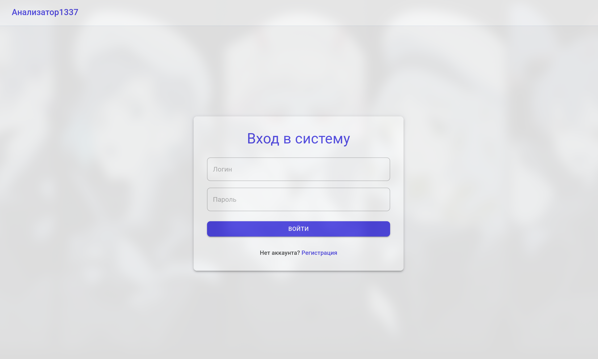

Экран регистрации:
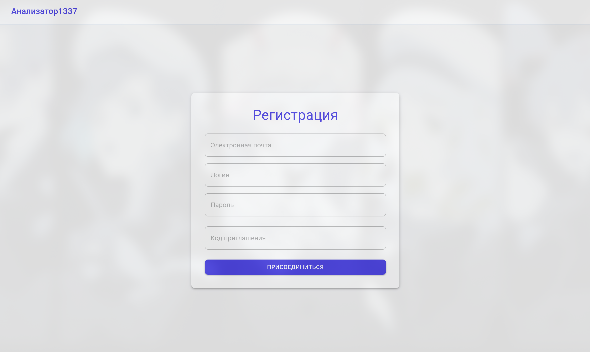

Экран основной панели с графом роли Архитектор:
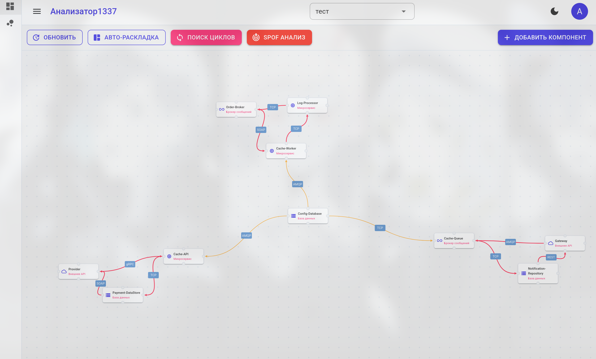

Экран управления системами (только роль Архитектор):
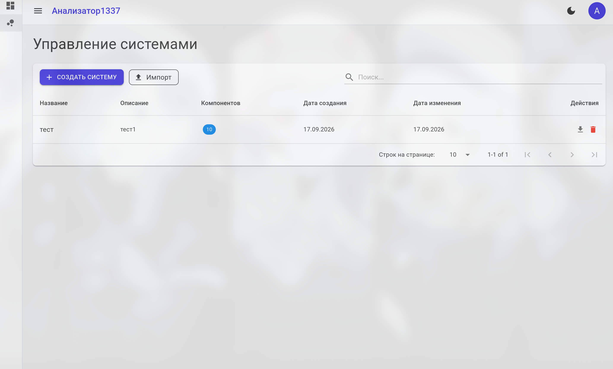

Экран профиля пользователя:
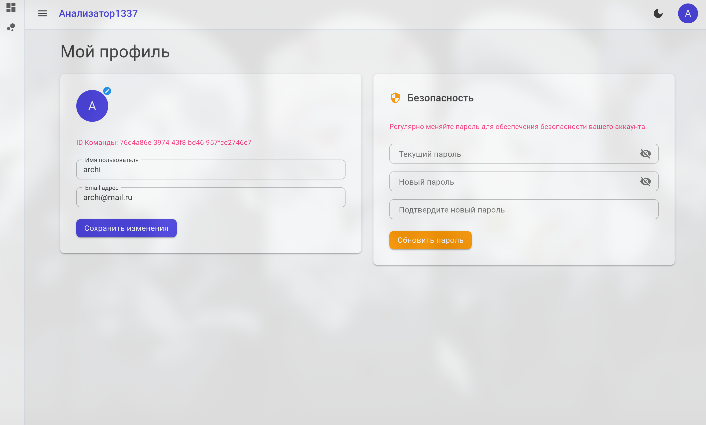

Экран управления пользователями (только роль Админ):
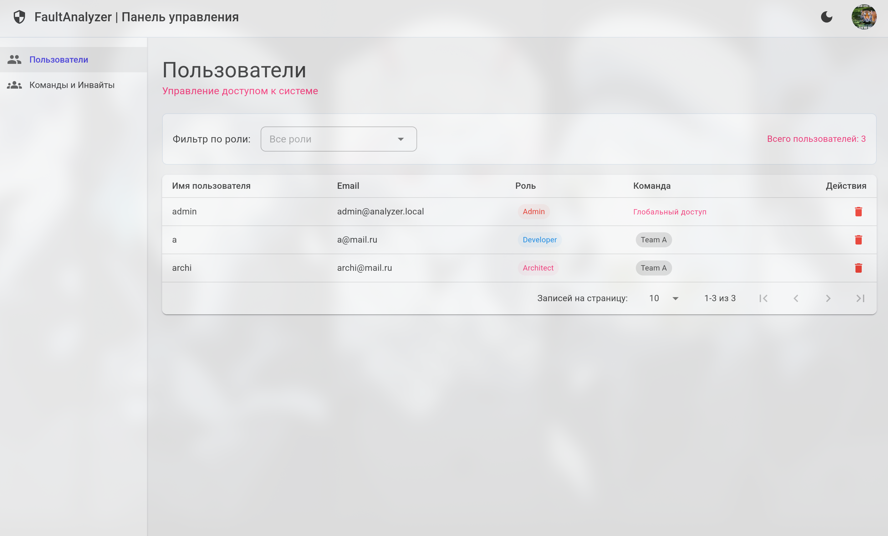

Экран управления командами (только роль Админ):
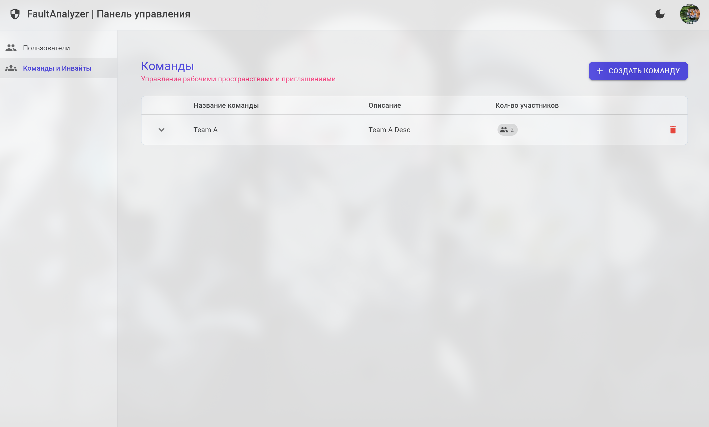